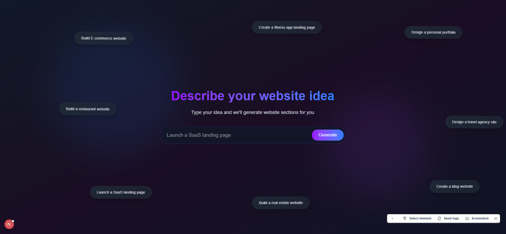
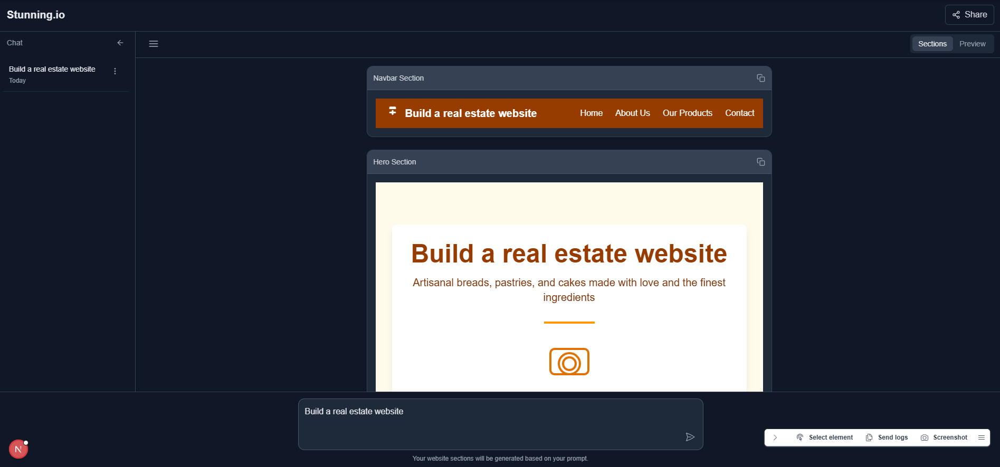
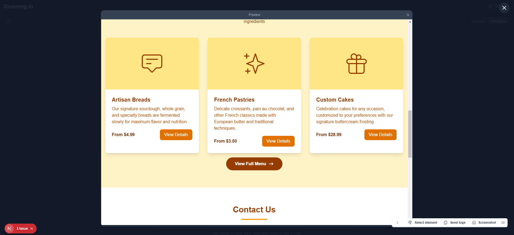
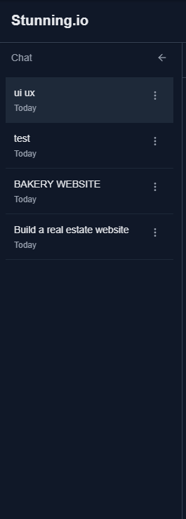
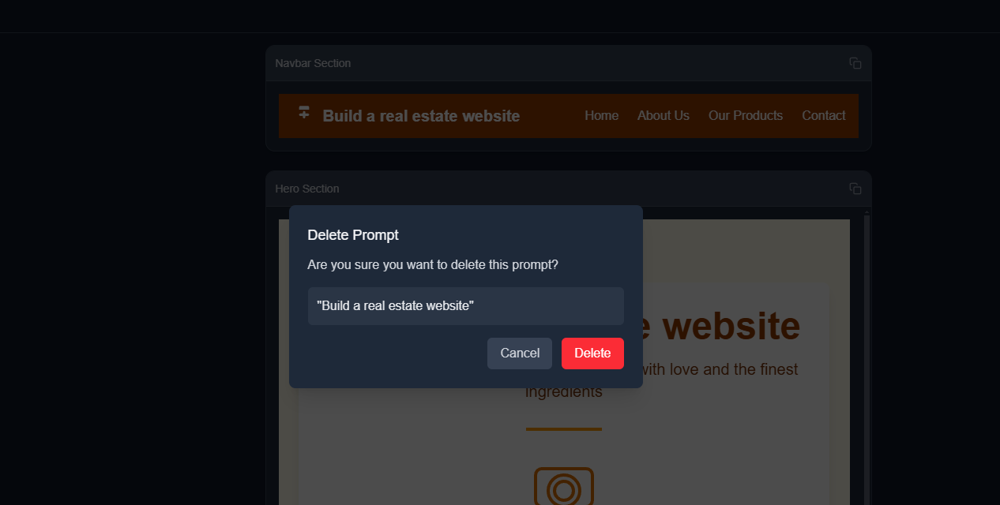
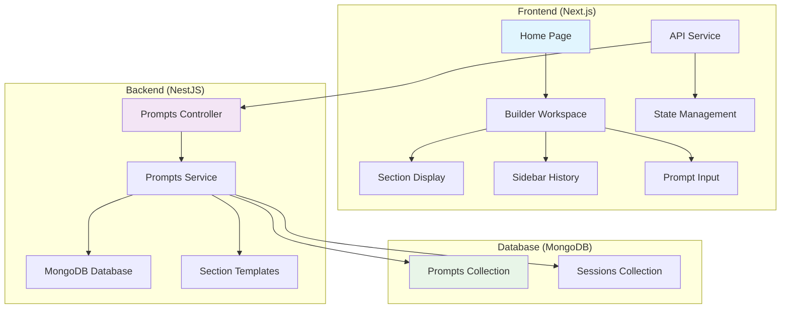

# Website Idea Generator 🚀

> An AI-powered tool that generates beautiful website sections based on user prompts. Built with modern web technologies and featuring a ChatGPT-inspired interface.



## ✨ Features

- 🎯 **Interactive Prompt Input** - Animated suggestions with smooth transitions
- 🔄 **Real-time Preview** - Split-screen workspace with sections and preview modes
- 📚 **Smart History Management** - Persistent prompt history with session tracking
- 🎨 **Modern UI/UX** - ChatGPT-inspired interface with dark mode support
- 💾 **Offline Fallback** - localStorage caching for resilient user experience
- 🔧 **Error Handling** - Graceful error recovery with retry mechanisms
- 📱 **Responsive Design** - Works seamlessly across all device sizes
- ⚡ **Progressive Loading** - Simulated streaming with smooth animations

## 🎨 UI/UX Showcase

### Home Screen - Animated Prompt Experience

*Interactive prompt input with rotating suggestions and smooth animations*

### Builder Workspace - Split Screen Layout

*ChatGPT-inspired interface with sidebar history and main content area*

### Section Display - Dual View Modes

*Toggle between structured sections view and seamless preview mode*

### Responsive Design

*Fully responsive design optimized for mobile and tablet devices*

## 🏗️ System Architecture



### Architecture Components

- **Frontend Layer**: Next.js with React components, Tailwind CSS styling, and Framer Motion animations
- **API Layer**: NestJS with RESTful endpoints, CORS configuration, and error handling
- **Database Layer**: MongoDB with Mongoose ODM for data persistence and session management
- **State Management**: React hooks with optimistic UI updates and real-time synchronization

## 🗄️ Database Design

### Prompts Collection Schema
```typescript
{
  _id: ObjectId,
  text: string,           // User's prompt text
  sections: [
    {
      title: string,      // Section title (e.g., "Hero", "About")
      content: string     // Generated HTML content
    }
  ],
  sessionId: string,      // Browser session identifier
  createdAt: Date,        // Creation timestamp
  updatedAt: Date         // Last modification timestamp
}
```

### Key Database Features
- **Session-based Organization**: Prompts grouped by browser session
- **Active State Management**: Single active prompt per session
- **Timestamp Tracking**: Creation and modification history
- **Flexible Schema**: Extensible for future enhancements

## 📁 Project Structure

```
stunning/
├── 📁 frontend/                    # Next.js Frontend Application
│   ├── 📁 src/
│   │   ├── 📁 app/
│   │   │   ├── 📁 components/      # React Components
│   │   │   │   ├── BuilderWorkspace.tsx    # Main workspace UI
│   │   │   │   ├── Header.tsx              # Application header
│   │   │   │   ├── Sidebar.tsx             # Prompt history sidebar
│   │   │   │   ├── SectionDisplay.tsx      # Section rendering
│   │   │   │   ├── PromptInput.tsx         # Input component
│   │   │   │   ├── Toast.tsx               # Notification system
│   │   │   │   └── DeleteConfirmationModal.tsx
│   │   │   ├── 📁 services/        # API Services
│   │   │   │   └── api.ts                  # Backend communication
│   │   │   ├── 📁 styles/          # CSS Styles
│   │   │   │   ├── cloud-animations.css
│   │   │   │   └── custom-scrollbar.css
│   │   │   ├── globals.css         # Global styles
│   │   │   ├── layout.tsx          # Root layout
│   │   │   └── page.tsx            # Home page component
│   │   └── ...
│   ├── package.json
│   ├── tailwind.config.js
│   └── next.config.js
├── 📁 backend/                     # NestJS Backend Application
│   ├── 📁 src/
│   │   ├── 📁 prompts/             # Prompts Module
│   │   │   ├── prompts.controller.ts       # REST endpoints
│   │   │   ├── prompts.service.ts          # Business logic
│   │   │   ├── prompts.module.ts           # Module definition
│   │   │   ├── section-templates.ts        # HTML templates
│   │   │   └── dto/                        # Data transfer objects
│   │   ├── 📁 schemas/             # Database Schemas
│   │   │   └── prompt.schema.ts            # MongoDB schema
│   │   ├── 📁 config/              # Configuration
│   │   │   └── database.config.ts          # DB connection
│   │   ├── app.module.ts           # Root module
│   │   └── main.ts                 # Application entry
│   ├── package.json
│   └── nest-cli.json
├── 📁 images/                      # UI/UX Screenshots
│   ├── 1.png                       # Main application view
│   ├── 2.png                       # Home screen
│   ├── 3.png                       # Builder workspace
│   ├── 4.png                       # Section display
│   └── 5.png                       # Mobile responsive
├── README.md                       # Project documentation
└── plan.md                         # Development roadmap
```

## 🛠️ Tech Stack

### Frontend Technologies
- **Next.js 14** - React framework with App Router
- **React 18** - Component-based UI library
- **TypeScript** - Type-safe JavaScript
- **Tailwind CSS** - Utility-first CSS framework
- **Framer Motion** - Animation library
- **React Icons** - Icon components

### Backend Technologies
- **NestJS** - Progressive Node.js framework
- **MongoDB** - NoSQL document database
- **Mongoose** - MongoDB object modeling
- **TypeScript** - Type-safe server development
- **CORS** - Cross-origin resource sharing

### Development Tools
- **ESLint** - Code linting
- **Prettier** - Code formatting
- **Git** - Version control
- **XAMPP** - Local development environment

## 🚀 Getting Started

### Prerequisites

- **Node.js** (v18 or higher)
- **MongoDB** (local installation or Atlas cloud)
- **npm** or **yarn** package manager
- **Git** for version control

### 💾 Installation

1. **Clone the repository:**
   ```bash
   git clone <repository-url>
   cd stunning
   ```

2. **Install frontend dependencies:**
   ```bash
   cd frontend
   npm install
   ```

3. **Install backend dependencies:**
   ```bash
   cd ../backend
   npm install
   ```

4. **Set up environment variables:**
   
   Create `.env` file in the backend directory:
   ```env
   MONGODB_URI=mongodb://localhost:27017/website-generator
   PORT=3001
   NODE_ENV=development
   ```
   
   Create `.env.local` file in the frontend directory:
   ```env
   NEXT_PUBLIC_API_URL=http://localhost:3001
   ```

5. **Start the development servers:**
   ```bash
   # Terminal 1 - Backend Server
   cd backend
   npm run start:dev
   
   # Terminal 2 - Frontend Server
   cd frontend
   npm run dev
   ```

6. **Open your browser:**
   Navigate to [http://localhost:3000](http://localhost:3000) to see the application

### 🔧 Development Scripts

#### Frontend Commands
```bash
npm run dev          # Start development server
npm run build        # Build for production
npm run start        # Start production server
npm run lint         # Run ESLint
npm run lint:fix     # Fix ESLint issues
```

#### Backend Commands
```bash
npm run start:dev    # Start development server with hot reload
npm run start:prod   # Start production server
npm run build        # Build TypeScript to JavaScript
npm run test         # Run unit tests
npm run test:e2e     # Run end-to-end tests
```

## 🔌 API Endpoints

### Prompts Management
| Method | Endpoint | Description | Request Body |
|--------|----------|-------------|-------------|
| `POST` | `/api/prompts/generate` | Generate sections from prompt | `{ "text": "string", "sessionId": "string" }` |
| `GET` | `/api/prompts/history` | Get prompt history for session | Query: `?sessionId=string` |
| `GET` | `/api/prompts/:id` | Get specific prompt details | - |
| `DELETE` | `/api/prompts/:id` | Delete a prompt | - |

### Response Examples

**Generate Sections Response:**
```json
{
  "_id": "507f1f77bcf86cd799439011",
  "text": "Create a modern bakery website",
  "sections": [
    {
      "title": "Hero",
      "content": "<section class='hero'>...</section>"
    },
    {
      "title": "About",
      "content": "<section class='about'>...</section>"
    }
  ],
  "sessionId": "session-123",
  "isActive": true,
  "createdAt": "2024-01-15T10:30:00.000Z"
}
```

## 📝 Key Features Deep Dive

### 🎨 UI/UX Highlights
- **ChatGPT-inspired Interface**: Familiar chat-like experience with modern design
- **Smooth Animations**: Framer Motion powered transitions and micro-interactions
- **Responsive Layout**: Mobile-first design that works on all screen sizes
- **Dark Mode Support**: Elegant dark theme with proper contrast ratios
- **Toast Notifications**: Non-intrusive feedback for user actions

### ⚙️ Technical Highlights
- **Type Safety**: Full TypeScript implementation across frontend and backend
- **State Management**: Optimistic UI updates with proper error handling
- **Session Persistence**: Browser session tracking for user continuity
- **Error Boundaries**: Graceful error handling with fallback UI
- **Performance Optimized**: Code splitting and lazy loading for fast load times


## 🕰️ Development Roadmap

Refer to [`plan.md`](./plan.md) for detailed development phases and progress tracking.

### ✅ Completed Features
- [x] Project setup and configuration
- [x] Animated home screen with prompt suggestions
- [x] Split-screen builder workspace
- [x] MongoDB integration and schema design
- [x] Progressive section generation
- [x] Prompt history management
- [x] Error handling and offline fallback
- [x] Responsive design and animations
- [x] Delete confirmation and state management
- [x] UI/UX improvements and ChatGPT-style interface

### 🕰️ Future Enhancements
- [ ] User authentication and accounts
- [ ] Real-time collaboration features
- [ ] Advanced section customization
- [ ] Export functionality (HTML/CSS/React)
- [ ] Template marketplace
- [ ] AI-powered design suggestions
- [ ] Performance analytics dashboard


